# AFTERGLOW — 컴퓨터그래픽스 기말 과제 리포트

> 1인칭 3D 라이트 퍼즐. **표면에서 튕기고·꺾이고·섞인 간접광(CPU SurfelGI 근사)이 충분히 닿은 바닥만 밟을 수 있다.** GI는 시각 효과가 아니라 게임 규칙 그 자체다.
> 제작: 이교원 · 게임 링크: https://kyowon1108.github.io/afterglow-computer-graphics-final/ · 코드: https://github.com/kyowon1108/afterglow-computer-graphics-final
> 📄 슬라이드 PDF 버전: [AFTERGLOW-report.pdf](./AFTERGLOW-report.pdf)

---

## 1. 기획 — 출처와 핵심 아이디어

화면에서 보이는 한 점의 색은 렌더링 방정식(강의 L4)으로 정해진다.

> **Lₒ(x, ωₒ) = Lₑ(x, ωₒ) + ∫Ω fr(x, ωᵢ, ωₒ) · Lᵢ(x, ωᵢ) · (ωᵢ·n) dωᵢ**

대부분의 게임은 이 방정식의 **결과를 그저 본다.** AFTERGLOW는 이 식의 **간접항(∫, 표면에서 튕겨 들어온 빛)을 "밟을 수 있는 바닥"이라는 게임 규칙으로** 만들었다. 즉 SurfelGI(강의 L8)로 계산한 **간접 복사휘도(indirect irradiance)가 곧 지형**이다.

- "빛이 닿은 것만 존재한다"는 규칙은 인디게임 **Closure(2012)** 에서 가져왔다.
- 그 빛을 표면 점(surfel)에 캐싱하는 방식은 EA의 **GIBS(Global Illumination Based on Surfels, SIGGRAPH 2021)** 에서 가져왔다.
- 우리만의 비틀기: Closure는 *직접광*이면 충분했지만, AFTERGLOW는 **빛을 조준·거울로 꺾고·프리즘으로 섞어야** 길이 생긴다. 그래서 GI를 끄면 단순히 어두워지는 게 아니라 **길 자체가 사라진다.**

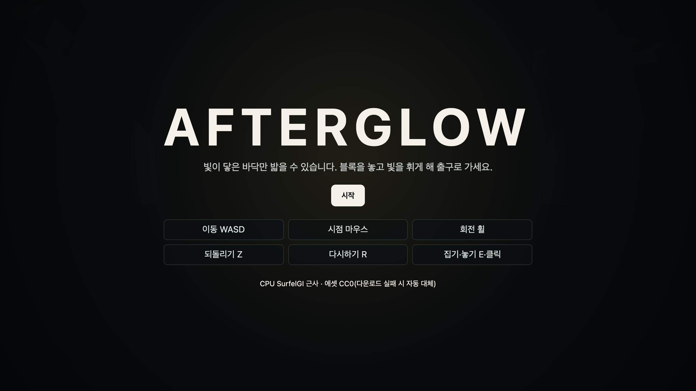
*그림 1. 타이틀 화면. "빛이 닿은 바닥만 밟을 수 있다"는 한 줄 규칙과 조작 안내.*

---

## 2. 게임 규칙과 조작

- **목표:** 발광 블록을 소켓에 놓고 빛을 조준·라우팅·혼합해 길을 만든 뒤, 색 게이트를 열어 **정확한 출구**에 도달한다.
- **승리 조건:** 출구 칸 도달 + 모든 게이트 개방 + 손에 든 블록 없음 + 바닥에 서 있음.
- **실패:** 어두운(빛이 부족한) 바닥을 밟으면 떨어져 시작점으로 즉시 리스폰. 목숨·타이머 없음(무한 재시도).
- **조작:** 이동 WASD · 시점 마우스 · 집기·놓기 E/클릭 · 회전 휠·`[ ]` · 색 Q · 되돌리기 Z · 다시하기 R · GI 비교 G · 패스 보기 B · 위에서 보기 M · 3인칭 T · 디버그 F1·V·N · 도움말 ?.

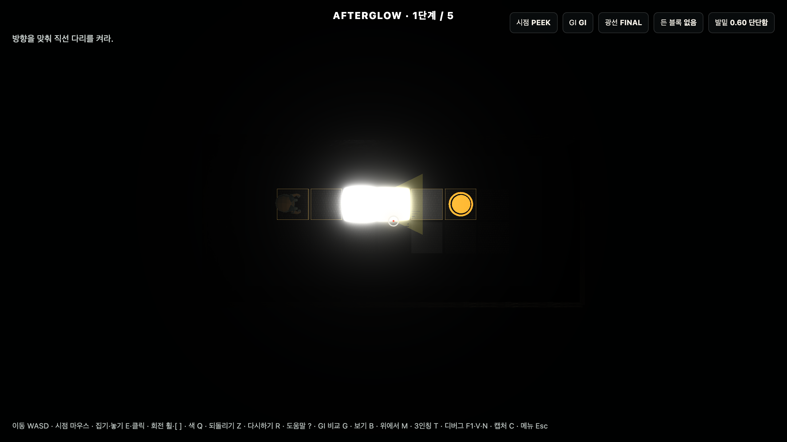
*그림 1b. 실제 플레이 화면 — 블록을 소켓에 놓고 빛을 조준해 1단계의 길을 켠 모습.*

---

## 3. 시스템 구조 — 2-레이어 (로직 ↔ 시각)

게임 판정과 화면을 분리했다.

- **로직 레이어(CPU·결정적):** `SurfelSolver.js`, `sampleField.js`, `rules.js`, `levels.js`, `math.js`. 표면 surfel의 직접광 + 거울 재방출 + 2회 바운스를 계산해 각 바닥의 복사휘도를 구하고, 그 밝기가 임계값(WALK_ON 0.60)을 넘으면 그 자리를 solid로 판정한다. **GPU 읽기를 쓰지 않아** 하드웨어와 무관하게 같은 결과가 나오고, headless로 검증된다.
- **시각 레이어:** 같은 surfel 값을 타일 emissive·포인트 라이트·블룸·아웃라인으로 그려서 보여준다.

핵심 로직 발췌 (`src/gi/SurfelSolver.js`, `sampleField.js`) — 강의 이론이 코드로 어떻게 들어갔는지:

```js
// ① 직접광 Lₑ — (ωᵢ·n) 코사인 · 역제곱 감쇠 · 가림(shadow) · 조준 원뿔 (강의 L4 렌더링 방정식)
function addDirectContribution(surfel, emitter, level, bucket) {
  if (!visible(emitter.pos, surfel.pos, level.walls)) return;                   // 가시성(occlusion)
  const cosT = targetCosTerm(surfel, emitter.pos);                              // (ωᵢ·n)
  const cone = coneWeight(emitter.pos, surfel.pos, emitter.emitDir, emitter.coneDeg); // 조준 방향
  const d2   = Math.max(distanceSq3(emitter.pos, surfel.pos), 0.25);            // 역제곱
  addColor(bucket, scaledColor(emitter.rgb, (emitter.intensity * cosT * cone) / d2));
}

// ② 간접광 ∫ — 이웃 surfel의 빛을 form factor로 누적(2회 바운스 radiosity) (강의 L8 SurfelGI)
function formFactor(target, source) {            // cosθ_s · cosθ_n / (π·d²)
  const dir = normalize3(sub3(source.pos, target.pos));
  const cosS = normalCos(target, dir), cosN = normalCos(source, neg(dir));
  return (cosS * cosN) / (Math.PI * Math.max(distanceSq3(target.pos, source.pos), 0.25));
}
// computeBounce: addColor(target[pass], albedo·sourceEnergy · f · AREA · GAIN); clampIndirect(...) // 에너지 클램프

// ③ "밟을 수 있는가" = 복사휘도 임계값 (+색 게이트는 색조 일치) → 이것이 곧 게임 규칙
function updateWalkable(surfel) {
  const E = surfel.gameplayIrradiance;           // placed + 거울 재방출 + 바운스 (carried 빛 제외)
  surfel.walkable = surfel.gateColor
    ? hueMatchesGate(E, gateRGB)                 // 색 게이트: 밝기 + 채도 + 색조
    : luminance(E) >= WALK_ON;                   // 일반 바닥: 밝기 임계값
}

// ④ 연속 위치 판정 — 발밑(x,z)에서 4개 surfel을 bilinear 보간 (그리드에 안 묶인 자유 이동)
function sampleIrradianceAt(level, x, z) { /* 4-surfel bilinear → luminance */ }
```

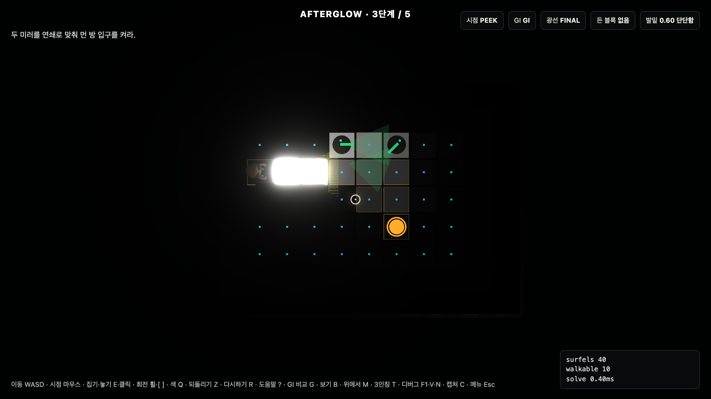
*그림 2. 표면에 분포한 surfel 캐시(디버그 뷰). 각 점이 그 지점으로 들어온 빛을 저장한다 — GIBS의 surface lighting cache 개념.*

---

## 4. [강의 L4] 조명과 렌더링 방정식

발광 블록은 방정식의 **자기 발광항 Lₑ** 에 해당한다. 블록은 방향(`emitDir`)과 원뿔 각도(`coneDeg`)를 가지며, surfel로 들어가는 직접광은 **코사인 항 + 역제곱 감쇠 + 가림(visibility) 검사**로 계산된다(원뿔 가중치 포함). 즉 강의의 광원·BRDF·코사인·거리 감쇠가 그대로 들어가 있다.

| 배치 전 (직접광 없음) | 배치 후 (직접광이 바닥을 켬) |
|---|---|
| 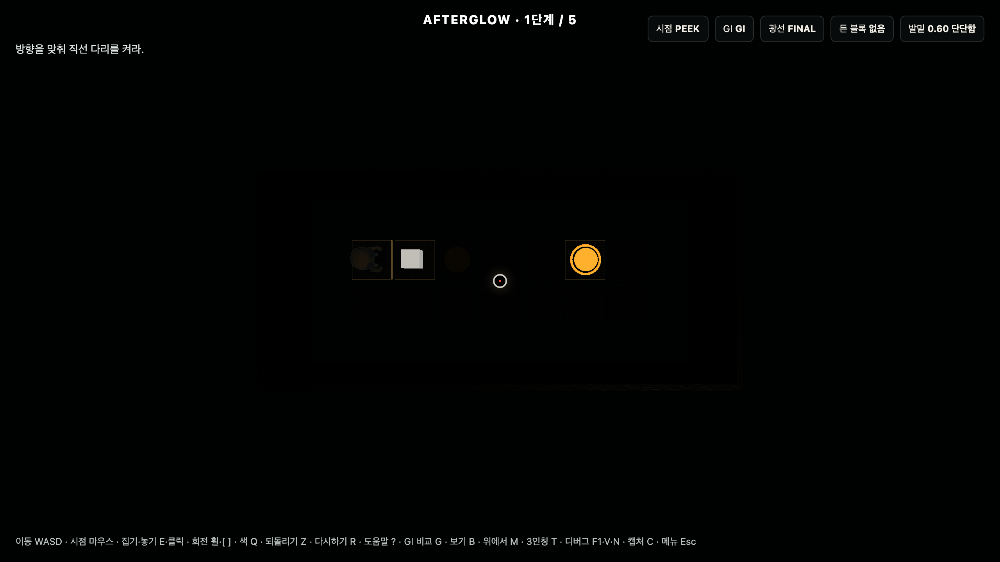 |  |

*그림 3. 1단계. 블록을 소켓에 놓고 동쪽으로 조준하면 직선 바닥이 켜진다. 잘못 조준하면(왼쪽) 앞 바닥이 어두워 밟을 수 없다 = 방정식의 Lₑ + 코사인/감쇠가 게임 규칙으로 작동.*

---

## 5. [강의 L8] SurfelGI — 간접광이 곧 길

### 5.1 직접 → 1차 바운스 → 2차 바운스 누적
같은 장면·같은 카메라에서 모드만 바꿔 촬영했다. 직접광만으로는 어둡던 바닥이 바운스를 한 번, 두 번 누적할수록 켜진다.

| 직접광만 (DIRECT) | +1차 바운스 (BOUNCE1) | +2차 바운스 (GI) |
|---|---|---|
| 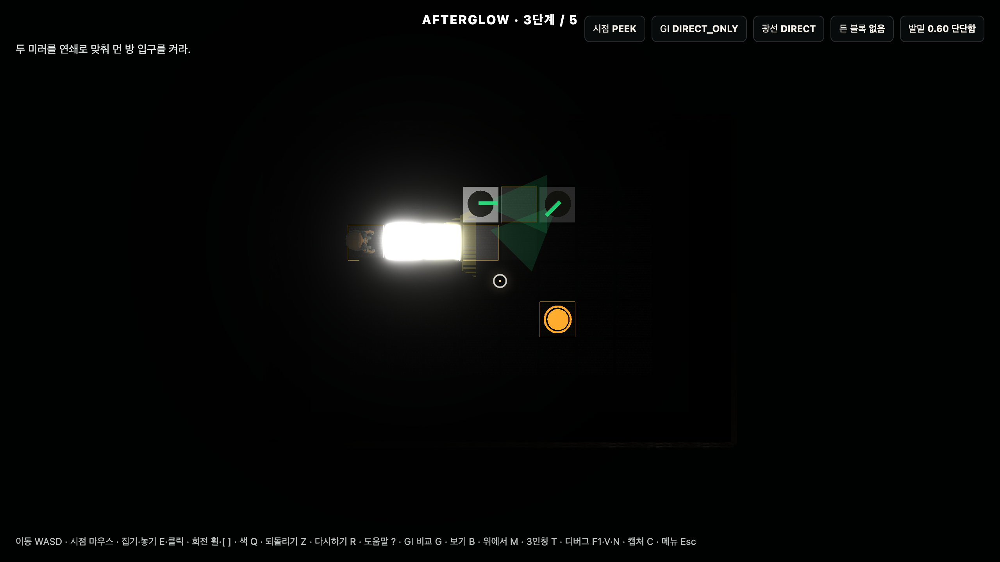 |  |  |

*그림 4. 3단계. SurfelGI의 다중 바운스 — `formFactor(cosθ_s·cosθ_n / π·d²)`로 이웃 surfel의 빛을 누적한다(에너지 클램프 적용).*

### 5.2 GI가 곧 게임 규칙 (off ↔ on)
같은 배치·같은 카메라에서, **GI를 끄면 거울로 꺾인 빛이 사라져 코너 뒤 길이 없어지고(좌), 켜면 길이 생긴다(우).**

| GI off — 코너 뒤 void | GI on — 거울 반사로 길 생성 |
|---|---|
| 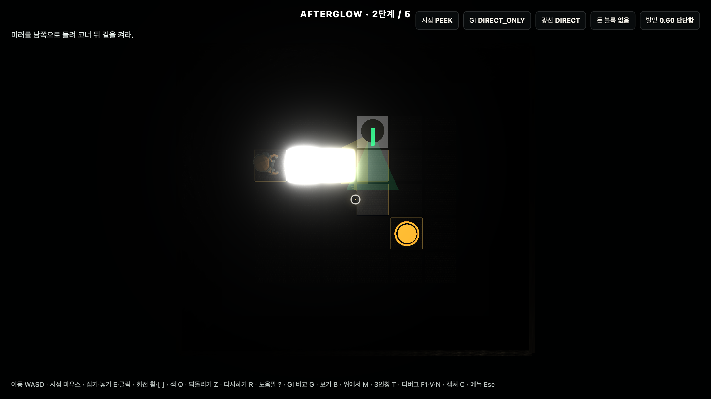 | 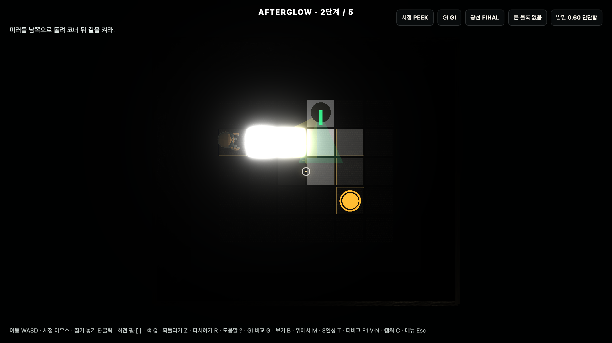 |

*그림 5. 2단계. "GI를 끄면 예쁜 효과가 사라지는 게 아니라 길 자체가 사라진다" — 이 게임의 핵심 주장.*

> **정직성:** 본 구현은 **CPU SurfelGI 근사**다. DDGI도, 물리적으로 정확한 SurfelGI 렌더러도 아니다. 거울은 specular 반사가 아니라 **방향성 diffuse relay**이며, `MIRROR_GAIN`은 게임 튜닝값이다(에너지 보존은 radiosity 바운스 패스에 한정).

### 5.3 강의 SurfelGI(GPU) vs 본 구현(CPU 근사) — 무엇을, 왜 이렇게 진행했는가

강의 L8 SurfelGI의 **핵심 개념**(표면에 박은 surfel을 빛 캐시로 두고, 직접광 + 이웃 surfel의 간접광을 재사용)은 그대로 가져왔다. 다만 우리는 GI를 *화면 렌더링*이 아니라 **게임 규칙(`walkable`·색 게이트)** 으로 쓰기 때문에, GPU 레이트레이싱 대신 **CPU 해석적 라디오시티**로 구현했다.

| 항목 | 강의 SurfelGI / GPU 충실구현(EA GIBS, webgiya) | 본 구현 (CPU 근사) |
|---|---|---|
| surfel = 표면 광 캐시 | ✅ | ✅ (바닥·벽·거울 타일) |
| 빛 수집 | 반구 **레이트레이싱**(three-mesh-bvh, importance sampling) | **해석적**: cos·1/d²·가림·조준 원뿔 + form-factor |
| 간접광/바운스 | 무한 재귀 + **temporal 누적**(MSME 등) | **2-bounce form factor** + 에너지 클램프(결정적) |
| 저장 | 구면조화(SH) | RGB irradiance |
| 연산/판정 | **GPU**, 다프레임 수렴(노이즈 제거) | **CPU**, 즉시·결정적, **Node headless 검증** |
| 광원 | 정적 지오메트리 + **단일 directional**, *emissive 없음* | **다수의 동적 발광 블록** + 회전 거울·프리즘 |
| 산출물 | 픽셀 셰이딩(시각) | `walkable`·게이트·레벨 검증(**게임 규칙**) |

**왜 CPU 근사를 택했나**
1. 우리 게임에서 GI 결과는 "예쁜 조명"이 아니라 **밟을 수 있는 바닥/게이트 개방을 정하는 규칙**이다. 따라서 **즉시·결정적·headless 검증 가능**해야 한다. GPU temporal GI는 다프레임 수렴·async readback·드라이버 차이가 들어가 규칙의 진실원으로 쓸 수 없다.
2. 우리 핵심 메커닉은 **다수의 동적 발광 블록 + 이동/회전하는 거울·프리즘**이다. 충실한 GPU 구현(webgiya)은 본문에서 **정적 지오메트리·단일 directional 광·emissive 미지원**을 한계로 명시하므로, 우리 설계와 정면으로 충돌한다.
3. 그래서 EA GIBS의 **surfel 개념은 채택**하되, 실시간 게임 규칙 검증을 위해 **결정적 CPU 라디오시티로 근사**했다. 누수(leak)는 GPU 구현이 radial-depth atlas로 푸는 문제를, 우리는 **2D segment 가시성 검사**로 동일 목적 달성.

**검증:** `npm run validate:levels`가 모든 레벨에서 (a) 정확 출구+전 게이트 개방이라야 클리어, (b) **의도 외 클리어(치즈)가 0개**, (c) carried 빛으로는 길/게이트 불가까지 단언한다. 즉 "근사"이지만 **게임 규칙으로서는 정확하고 견고**하다.

> 참고: EA SEED, *Global Illumination Based on Surfels (GIBS)*, SIGGRAPH 2021 / Jure Triglav, *Surfel-based GI on the web*(WebGPU 충실 구현, 본인도 "biased real-time approximation"이며 emissive·동적 장면 미지원이라 명시).

---

## 6. [강의 L5] 텍스처 · UV · 노멀맵

바닥/벽/바운스 패널에 **ambientCG의 CC0 PBR 텍스처**(basecolor·normal·roughness·ao)를 적용했다. 다운로드 실패 시 절차적 CanvasTexture로 대체된다. 노멀맵은 **시각 표면 디테일 전용**이며, GI solver는 결정성을 위해 geometric normal만 사용한다.

| 다운로드한 basecolor (PavingStones033) | 같은 텍스처의 normal map |
|---|---|
| 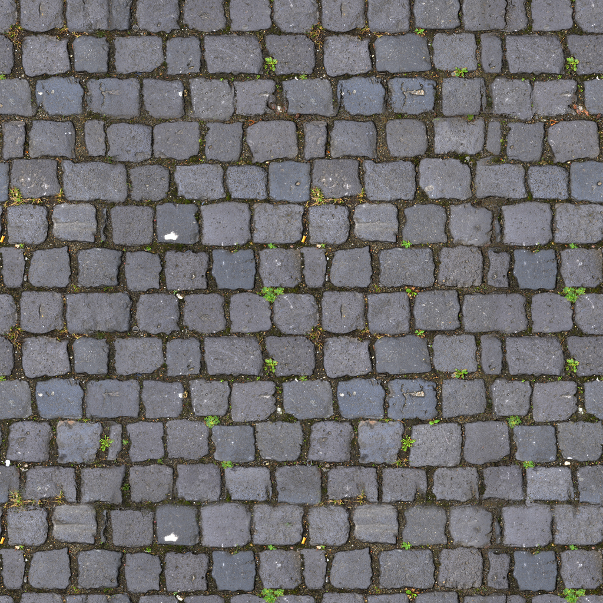 | 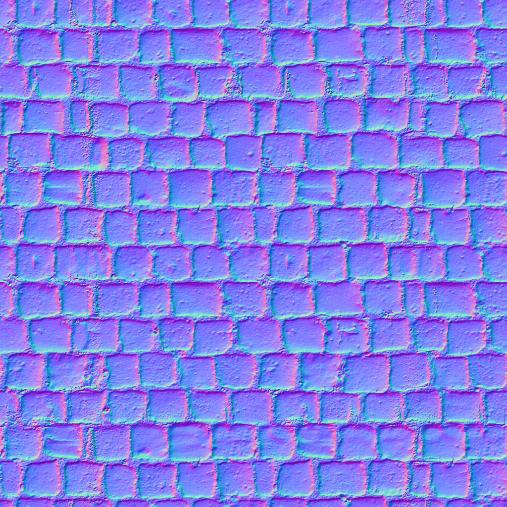 |

*그림 6. 적용한 PBR 텍스처 원본(좌: 알베도, 우: 노멀). UV는 타일 크기 기준으로 RepeatWrapping.*

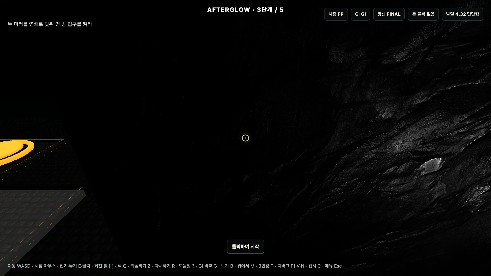
*그림 7. 인게임 적용 결과 — 바닥/벽 텍스처 타일링과 노멀맵 음영 디테일.*

(벽: Rock013, 바운스 패널: Concrete042A 텍스처 사용.)

---

## 7. [강의 L6] 스켈레톤 · 애니메이션

플레이어 캐릭터로 three.js 예제의 **RobotExpressive.glb**(CC0, Tomás Laulhé)를 사용하고, `AnimationMixer`로 속도에 따라 Idle/Walking/Running 클립을 전환한다. 모델 로드 실패 시 절차적 캡슐 로봇으로 대체된다. 3인칭(T)에서 스킨드 메시 + 애니메이션을 확인할 수 있다.

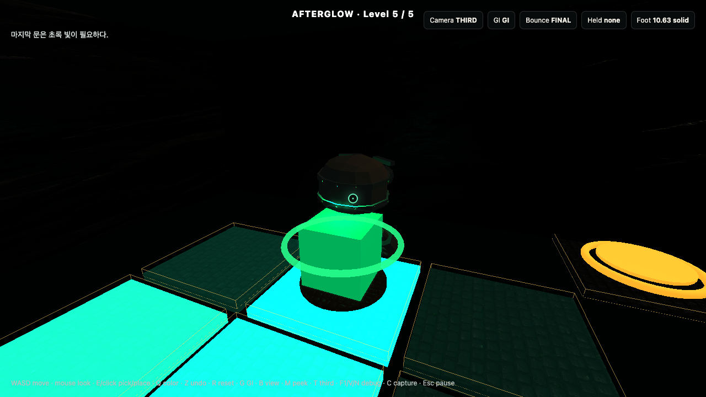
*그림 8. 3인칭 뷰의 RobotExpressive 걷기 애니메이션.*

---

## 8. 색 시스템 — 프리즘 분광과 가산 혼합

프리즘은 흰빛을 **빨강·초록·파랑 세 방향 원뿔**로 나눈다. 두 색이 같은 바닥에 겹치면 **가산 혼합**(빨강+초록=노랑, 빨강+파랑=마젠타)된다. 색 게이트는 흰빛으로는 못 열고, `밝기 ≥ GATE_ON AND 채도 ≥ MIN_CHROMA AND 색조 일치(hueDot ≥ 0.88)` 를 만족해야 열린다(색맹 대비로 색 외에 아이콘·패턴 병행).

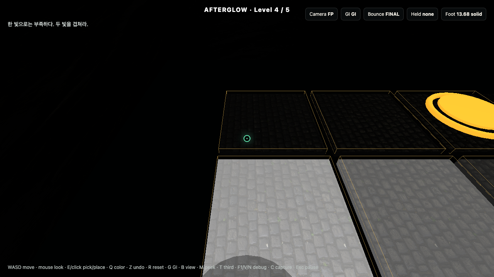
*그림 9. 4단계. 프리즘이 흰빛을 분광 → 빨강+초록이 겹쳐 노란 게이트를 연다.*

| 게이트 잠김 (색 부족) | 게이트 열림 (정확한 색) |
|---|---|
| 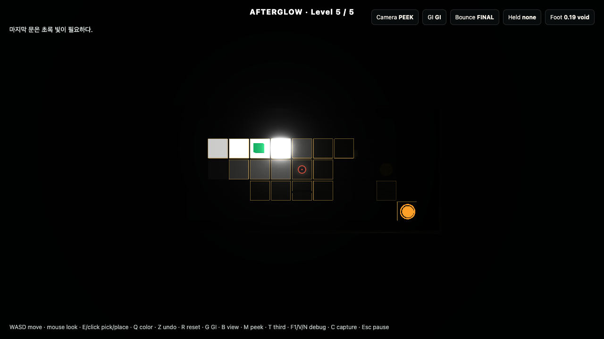 | 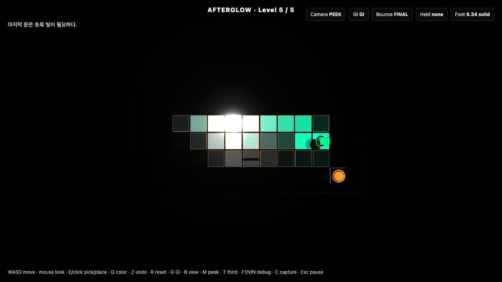 |

*그림 10. 색조가 맞아야만 게이트가 열린다.*

---

## 9. 레벨 디자인 (5단계, 한 단계당 한 동사)

| 단계 | 이름 | 새 동사 | 핵심 |
|---|---|---|---|
| 1 | 첫 빛: 방향 맞추기 | 조준 | 직접광 방향으로 길 켜기 |
| 2 | 모퉁이 돌리기 | 거울 회전 | 빛을 꺾어 코너 뒤 점등 |
| 3 | 두 거울로 잇기 | 다중 거울 | 두 번 꺾어 먼 방까지 |
| 4 | 흰빛에서 노랑으로 | 프리즘·색혼합 | 빨강+초록=노랑 게이트 |
| 5 | 잔광, 마젠타 | 거울+혼합 | 빨강+파랑=마젠타 피날레 |

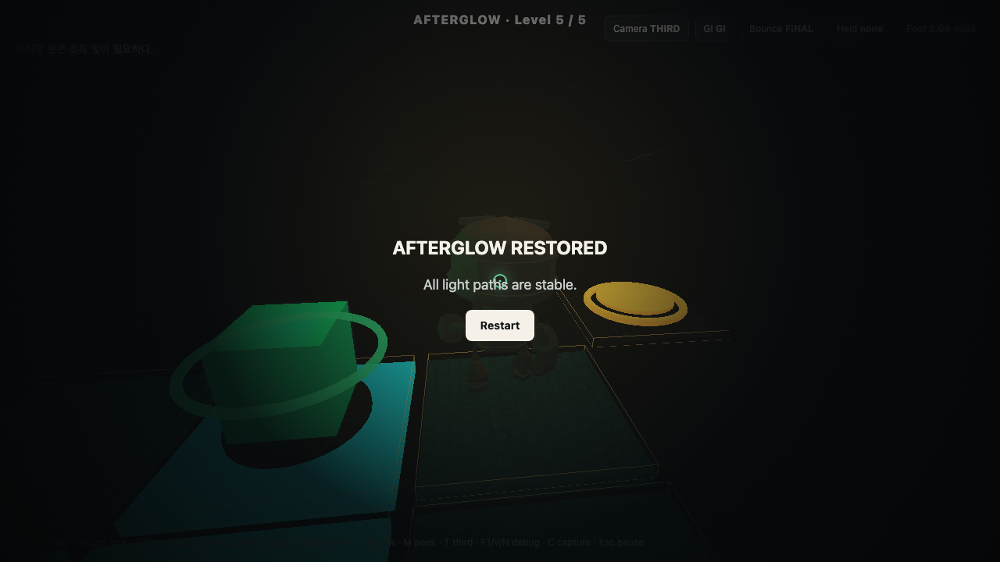
*그림 11. 5단계 클리어 후 완료 화면.*

---

## 10. 검증 (재현 가능한 정합성)

`npm run validate:levels`(headless, Node)로 다음을 보증한다.
- start·exit는 항상 solid, **정확 출구 + 모든 게이트 개방**이라야 클리어.
- **전수 부정검증:** 각 레벨에서 가능한 배치/방향/색/거울각 조합을 모두 돌려, **의도 해법 클래스 밖의 클리어(치즈)가 0개**임을 단언(bypass=0).
- carried 빛은 절대 바닥/게이트를 만들지 못함, 거울·패널은 통과 불가.
- 빈 방 희소성 프로브가 국소(블록 1개=일부 타일만)로 유지(범람 아님).

`npm run build`가 이 검증을 통과해야만 빌드된다. 상호작용은 `npm run smoke:interactions`(Playwright)로, 리포트 캡처는 `npm run capture:report`로 자동 생성한다.

---

## 11. 한계와 향후

- 거울/프리즘은 게임플레이용 **결정적 라우팅 모델**(specular/재귀 광학 시뮬레이션 아님).
- GI는 작은 실내 퍼즐에 맞춘 근사이며, 실시간 전역 GI 렌더러가 아니다.
- 향후: 자유 배치/색 페인팅으로 표현 자유도 확장, 더 많은 색 혼합 퍼즐.

---

## 12. 빌드 · 실행 · 출처

```bash
npm install
npx playwright install chromium
npm run fetch-assets
npm run dev      # 플레이
npm run build    # = validate:levels && vite build
```

**출처/크레딧**
- 규칙 영감: Closure (Eyebrow Interactive, 2012).
- GI 기법: EA SEED, *Global Illumination Based on Surfels (GIBS)*, SIGGRAPH 2021.
- 텍스처: ambientCG (CC0) — PavingStones033, Rock013, Concrete042A.
- 캐릭터: RobotExpressive.glb (CC0, Tomás Laulhé), three.js 예제.
- 강의 자료: L4 Lighting & Shading, L5 Texture, L6 Skeleton & Animation, L8 Surfel-based Global Illumination.
